# GRYDAI: STRUCTURED 36-HOUR MASTER DEVELOPMENT PLAN

**Project:** GrydAI - AI-Powered Smart Grid Anomaly Monitor & Physical Node  
**Scope Focus:** Backend (Python / FastAPI / Scikit-Learn) & Embedded Firmware (ESP32 C++)  
**Collaboration Model:** Decoupled parallel development with 2-person Frontend Team  
**Status:** Approved & Active Execution Baseline  

---

## 1. Master Milestone Roadmap

```mermaid
gantt
    title GrydAI 36-Hour Development Sprint
    dateFormat  X
    axisFormat  Hour %s

    section Phase 1: Foundation
    FastAPI WebSocket & --mock generator     :active, p1_be, 0, 4
    Next.js Scaffolding & MapLibre Setup     :active, p1_fe, 0, 4
    Firmware Scaffolding & Pinout Setup      :active, p1_hw, 1, 4

    section Phase 2: Hardware Reality
    ESP32 C++ 10Hz Loop & OLED Driver        :p2_hw, 4, 10
    PySerial Ingestion & Contract 3 Reverse  :p2_be, 4, 10
    Frontend Waveform Charts & Status Alerts :p2_fe, 4, 10

    section Phase 3: Machine Learning
    Scikit-Learn Autoencoder & Dynamic Calib :p3_ml, 10, 20
    Real-Time Reconstruction MSE & State Machine :p3_be, 12, 20
    Frontend 3D Geospatial Pulse & Impact Calc   :p3_fe, 10, 20

    section Phase 4: Integration
    End-to-End Latency Tuning (<1.0s)        :p4_int, 20, 28
    Joint System Verification                :p4_test, 22, 28

    section Phase 5: Pitch & Polish
    3-Minute Pitch Choreography Rehearsals   :p5_pitch, 28, 34
    Code Freeze & Stability Hardening       :crit, p5_freeze, 32, 36
```

---

## 2. Phase-by-Phase Detailed Plan

### Phase 1: Foundation, Infrastructure & Decoupling (Hours 0–4)
**Primary Goal:** Decouple Frontend from Backend/Hardware immediately so the frontend team can build against a live moving data stream on Minute 1.

* **Backend & Firmware (Our Responsibilities):**
  1. Initialize `/backend` with FastAPI, Uvicorn, and CORS configuration.
  2. Implement `mock_generator.py`: Generates realistic 10 Hz telemetry sine-waves matching **Contract 2** (`voltage_sim`, `current_sim`, `solar_efficiency`, `ai_prediction`).
  3. Implement `main.py` WebSocket endpoint (`ws://localhost:8000/ws`) streaming mock data when `--mock` flag is passed.
  4. Implement `GET /api/status` for health verification.
  5. Scaffold `/firmware/smart_grid_node.ino` with pin definitions, serial initialization (115200 baud), and non-blocking `millis()` loop skeleton.
* **Frontend Team (Teammates' Responsibilities):**
  1. Scaffold Next.js (App Router) project with Tailwind CSS.
  2. Create `useWebSocket.ts` hook connecting to `ws://localhost:8000/ws`.
  3. Initialize MapLibre GL JS base map with CartoDB Dark Matter zero-token style.
* **Phase 1 Handoff Gate (Definition of Done):**
  * Frontend team runs `npm run dev`, connects to `ws://localhost:8000/ws`, and logs live JSON packets arriving at 10 Hz without errors.

---

### Phase 2: Hardware Reality & Bi-Directional Serial (Hours 4–10)
**Primary Goal:** Wire the physical ESP32 breadboard, stream live telemetry over USB Serial, and establish reverse hardware control.

* **Backend & Firmware (Our Responsibilities):**
  1. **ESP32 Firmware:**
     * Read analog pins (Pin 34 Voltage, Pin 35 Current, Pin 33 Solar LDR) and digital input (Pin 32 Button).
     * Output **Contract 1** JSON at 10 Hz over USB Serial at 115200 baud.
     * Implement decoupled SSD1306 OLED display refresh at 2–3 Hz (every 350 ms) showing local readings.
     * Implement non-blocking serial RX reader for **Contract 3** (`S:<status>:<score>\n`).
     * Control Status LEDs (Pin 25 Green, Pin 26 Yellow, Pin 27 Red) immediately upon command.
  2. **Python Backend:**
     * Implement `serial_reader.py` on a dedicated background thread with auto-detection of Windows COM ports.
     * Parse Contract 1 JSON, apply calibration formulas ($V_{\text{sim}}$, $I_{\text{sim}}$), and bridge to the WebSocket broadcaster.
     * Provide reverse transmission method to write Contract 3 back to ESP32 over serial.
* **Frontend Team (Teammates' Responsibilities):**
  1. Wire Recharts/Chart.js to plot real-time Voltage and Current waveforms (rolling 50-point window).
  2. Implement layout skeleton (Substation ID header, warning banners, metric cards).
* **Phase 2 Handoff Gate (Definition of Done):**
  * Turning physical potentiometer on breadboard updates live numbers on the frontend screen in real-time.

---

### Phase 3: The Brains - Unsupervised Machine Learning (Hours 10–20)
**Primary Goal:** Implement the Scikit-Learn Autoencoder, dynamic baseline calibration, real-time reconstruction error calculation, and bi-directional alert propagation.

* **Backend & Firmware (Our Responsibilities):**
  1. **ML Pipeline (`ml_pipeline.py`):**
     * Rolling 10-sample window computing feature vector $\mathbf{x} = [V_{\text{sim}}, I_{\text{sim}}, \Delta V, \Delta I, \text{Solar}]$.
     * Autoencoder using Scikit-Learn `MLPRegressor(hidden_layer_sizes=(8, 3, 8), activation='relu')`.
     * Live Reconstruction Mean Squared Error (MSE) calculation: $\frac{1}{N}\sum (\mathbf{x} - \mathbf{\hat{x}})^2$.
  2. **Dynamic Calibration & Threshold Engine:**
     * `POST /api/calibrate`: 5-second sampling routine to calculate baseline mean ($\mu_{\text{MSE}}$) and standard deviation ($\sigma_{\text{MSE}}$).
     * State Machine:
       * Status `0` (Normal / Green): $\text{MSE} \le \mu + 2.0\sigma$
       * Status `1` (Warning / Yellow): $\mu + 2.0\sigma < \text{MSE} \le \mu + 3.5\sigma$
       * Status `2` (Critical / Red): $\text{MSE} > \mu + 3.5\sigma$ OR `fault_btn == 1`
  3. **Reverse Control Loop:**
     * Broadcast updated status and score to WebSockets (Contract 2) AND transmit `S:<grid_status>:<anomaly_score>\n` to ESP32 (Contract 3).
* **Frontend Team (Teammates' Responsibilities):**
  1. Bind MapLibre 3D substation marker color and pulsing animation to `ai_prediction.grid_status`.
  2. Add live Reconstruction Error (MSE) chart alongside Voltage/Current.
  3. Implement Predictive Impact Calculator:
     * *Downtime Prevented:* 42 Minutes
     * *Transformer Cost Avoided:* \$48,500
     * *Carbon Penalty Saved:* 2.4 Tons $CO_2$
* **Phase 3 Handoff Gate (Definition of Done):**
  * Dial turn triggers Yellow/Red status on screen AND flips physical breadboard LED in $< 500\text{ms}$.

---

### Phase 4: System Integration, Latency Tuning & Edge Cases (Hours 20–28)
**Primary Goal:** Connect all systems end-to-end, eliminate lag, and test resilience under failure conditions.

* **Joint Tasks (Full Team):**
  1. **Latency Benchmark:** Time the physical dial turn to screen marker color change. Must strictly be **$< 1.0\text{ second}$** (target: $\sim 250\text{ms}$).
  2. **Performance Optimization:** Ensure Next.js only re-renders the Chart and Marker components, preventing full-dashboard UI lag at 10 Hz.
  3. **Catastrophic Button Verification:** Verify that pressing Pin 32 push-button triggers instant Status 2 lockdown in $< 50\text{ms}$.
  4. **OLED Verification:** Verify OLED shows live metrics and flips between `[STABLE]`, `[WARNING]`, and `[CRITICAL]` without freezing the serial stream.
* **Phase 4 Handoff Gate (Definition of Done):**
  * 10 consecutive flawless fault-trigger cycles with zero crashes, zero memory leaks, and sub-second latency.

---

### Phase 5: Rehearsals, Choreography & Code Freeze (Hours 28–36)
**Primary Goal:** Absolute code freeze. Rehearse the 3-minute pitch until execution is muscle memory.

* **Pitch Choreography Breakdown:**
  * `0:00 - 0:45` Presenter 1: The Hook (Airbag vs Radar, EV overload blindspot at neighborhood transformers).
  * `0:45 - 1:30` Presenter 1: The Technology (Unsupervised Autoencoders, Edge inference solving bandwidth).
  * `1:30 - 2:30` Presenter 2: The Live Demonstration:
    * Stable baseline $\rightarrow$ Turn dial (EV surge) $\rightarrow$ MSE spikes $\rightarrow$ Yellow LED & Map pulse.
    * Tap button (Line break) $\rightarrow$ Instant Red emergency state.
  * `2:30 - 3:00` Presenter 1: The Impact Calculator (\$48,500 saved, 2.4T $CO_2$ avoided) & Q&A prep.
* **Strict Rule:** Zero feature additions during the final 8 hours. Fix only critical show-stopping bugs.

---

## 3. Risk Management & Contingency Matrix

| Risk Scenario | Probability | Impact | Automated / Prepared Contingency |
| :--- | :--- | :--- | :--- |
| **USB Serial Cable Disconnects on Stage** | Medium | Critical | Backend auto-reconnects in background; if unplugged, backend automatically flips to `--mock` mode so the web dashboard never goes blank. |
| **Venue Wi-Fi Is Blocked or Drops** | High | High | Entire stack is local: Backend on `localhost:8000`, Frontend on `localhost:3000`. MapLibre uses zero-token dark tiles with offline fallback. No internet required. |
| **Analog Potentiometer Electrical Jitter** | Medium | Medium | Backend implements a 5-sample rolling median filter to suppress ADC thermal noise without delaying deliberate turns. |
| **Autoencoder Overfitting / False Alarm** | Low | High | Dynamic calibration button (`/api/calibrate`) allows the presenter to recalibrate the baseline in 5 seconds before going on stage. |
| **OLED Display Slows Down Loop** | High | Critical | OLED refresh is strictly decoupled to 2–3 Hz via `millis()`. Telemetry stream runs on uninterrupted 10 Hz timer. |

---

## 4. Deliverable Verification Checklist

- [ ] **Firmware (`/firmware/smart_grid_node.ino`)**
  - [ ] Compiles cleanly in Arduino IDE with `Adafruit_SSD1306` and `Adafruit_GFX`.
  - [ ] 10 Hz non-blocking loop verified via serial oscilloscope/monitor.
  - [ ] SSD1306 OLED displays Node ID, V, I, Solar, Status, and Score.
  - [ ] Status LEDs (25, 26, 27) respond instantly to incoming serial commands.
- [ ] **Backend (`/backend`)**
  - [ ] `requirements.txt` installs without build tools or CUDA errors.
  - [ ] `main.py --mock` broadcasts valid Contract 2 JSON at 10 Hz over `ws://localhost:8000/ws`.
  - [ ] `main.py` connects to ESP32 over serial at 115200 baud and reads Contract 1.
  - [ ] `ml_pipeline.py` Autoencoder trains in $< 2\text{ seconds}$ and detects dial movement.
  - [ ] Reverse command `S:<status>:<score>\n` transmitted to hardware on state change.
- [ ] **Frontend Collaboration**
  - [ ] Contract 2 verified with frontend `useWebSocket` hook.
  - [ ] MapLibre 3D marker turns from Neon Green $\rightarrow$ Yellow $\rightarrow$ Red based on `grid_status`.