# GRYDAI: STRUCTURED MASTER DEVELOPMENT & EXECUTION PLAN

**Project:** GrydAI - AI-Powered Smart Grid Anomaly Monitor & Physical Node  
**Scope Focus:** Backend (Python / FastAPI / Scikit-Learn), Embedded Firmware (ESP32 C++), Frontend (React 18 + Vite)  
**Collaboration Model:** Decoupled parallel execution  
**Status:** Completed & Operational  

---

## 1. Master Milestone Roadmap

```mermaid
gantt
    title GrydAI Development Lifecycle
    dateFormat  X
    axisFormat  Phase %s

    section Phase 1: Foundation
    FastAPI WebSocket & --mock generator     :done, p1_be, 0, 4
    React 18 + Vite Scaffolding & Setup      :done, p1_fe, 0, 4
    Firmware Scaffolding & Pinout Setup      :done, p1_hw, 1, 4

    section Phase 2: Hardware Reality
    ESP32 C++ 10Hz Loop & OLED Driver        :done, p2_hw, 4, 10
    PySerial Ingestion & Contract 3 Reverse  :done, p2_be, 4, 10
    Frontend Waveform & Telemetry Cards      :done, p2_fe, 4, 10

    section Phase 3: Machine Learning
    Scikit-Learn Autoencoder & Dynamic Calib :done, p3_ml, 10, 20
    Real-Time Reconstruction MSE & Pipeline  :done, p3_be, 12, 20
    3D Isometric Hospital Digital Twin       :done, p3_fe, 10, 20

    section Phase 4: Analytics & Optimization
    Adaptive 3-Sigma MSE & Zero-Mock Ingest  :done, p4_an, 20, 26
    Camera Framing & UI Micro-Interactions   :done, p4_ui, 24, 28
    Verification & Latency Profiling (<10ms) :done, p4_test, 26, 30

    section Phase 5: Rehearsal & Hardening
    Live 3-Minute Demo Pitch Choreography    :done, p5_pitch, 30, 34
    Documentation, Contracts & Code Freeze   :done, p5_freeze, 34, 36
```

---

## 2. Phase-by-Phase Execution Breakdown

### Phase 1: Foundation, Infrastructure & Decoupling
* **Deliverables Completed:**
  * Initialized `/backend` with FastAPI, Uvicorn, and CORS configuration.
  * Implemented `mock_generator.py`: Generates realistic 10 Hz telemetry matching **Contract 2** (`voltage_sim`, `current_sim`, `solar_efficiency`, `ai_prediction`).
  * Implemented `main.py` WebSocket endpoint (`ws://localhost:8000/ws`) streaming mock data when `--mock` flag is passed.
  * Initialized `/firmware/smart_grid_node/smart_grid_node.ino` with non-blocking `millis()` loop and pin mapping.
  * Scaffolded `/FrontEnd` with React 18, Vite, and Tailwind CSS.

---

### Phase 2: Hardware Reality & Bi-Directional Serial
* **Deliverables Completed:**
  * **ESP32 Firmware:**
    * Read analog pins (Pin 34 Voltage, Pin 35 Current, Pin 33 Solar LDR) and digital input (Pin 32 Button).
    * Emitted **Contract 1** JSON at 10 Hz over USB Serial at 115200 baud.
    * Implemented decoupled SSD1306 OLED display refresh at 2–3 Hz showing local readings.
    * Implemented non-blocking serial RX reader for **Contract 3** (`S:<status>:<score>\n`).
    * Controlled Status LEDs (Pin 25 Green, Pin 26 Yellow, Pin 27 Red).
  * **Python Backend:**
    * Implemented `serial_reader.py` on a dedicated background thread with auto-detection of Windows COM ports.
    * Parsed Contract 1 JSON, applied engineering calibration formulas ($V_{\text{sim}}$, $I_{\text{sim}}$), and pushed to WebSocket.
    * Transmitted Contract 3 reverse commands back to ESP32.

---

### Phase 3: Machine Learning & 3D Command Portal
* **Deliverables Completed:**
  * **ML Pipeline (`ml_pipeline.py`):**
    * 4-dimensional normalized feature vector $[V_{\text{sim}}, I_{\text{sim}}, \Delta V, \Delta I]$ (solar decoupled).
    * Autoencoder using Scikit-Learn `MLPRegressor(hidden_layer_sizes=(8, 3, 8))`.
    * Reconstruction Mean Squared Error (MSE) calculation: $\frac{1}{N}\sum (\mathbf{x} - \mathbf{\hat{x}})^2$.
    * Dynamic recalibration via `POST /api/calibrate`.
  * **Frontend 3D Digital Twin:**
    * Integrated interactive 3D Isometric Hospital Model (`IsometricHospitalGrid.jsx`).
    * Implemented dynamic status aura highlighting facility vulnerability.

---

### Phase 4: Real-Time Analytics & Zero-Mock Verification
* **Deliverables Completed:**
  * Replaced static trip thresholds with the **Adaptive 3-Sigma MSE Reconstruction Chart** in `AnalyticsView.jsx`.
  * Implemented real-time incident logging and dynamic category breakdown driven exclusively by live telemetry.
  * Tuned camera framing and responsive zoom (0.28x default zoom for broad spatial context).
  * Hardened anti-flicker consensus filtering and verified $<10\text{ms}$ latency on physical button triggers.

---

### Phase 5: Production Readiness & Pitch Choreography
* **Deliverables Completed:**
  * Rehearsed 3-minute live pitch choreography (potentiometer dials $\rightarrow$ MSE spike $\rightarrow$ hardware LED click).
  * Synchronized all documentation, schemas, and requirements across the codebase.
  * Verified end-to-end reliability across hardware mode and simulation mode.