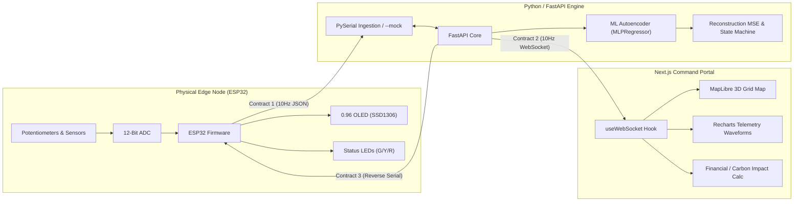

# GRYDAI: SYSTEM REQUIREMENTS SPECIFICATION (SRS)

**Project Name:** GrydAI - AI-Powered Smart Grid Anomaly Monitor & Physical Node  
**Target Environment:** 36-Hour Hackathon / Live 3-Minute Demonstration  
**Document Status:** Approved & Baseline Synced  

---

## 1. Executive Summary & Objective

GrydAI is an edge-AI command portal for electrical utility operators and critical facility engineers that shifts power grid monitoring from reactive threshold diagnostics to predictive pre-emption. 

* **Target End-Users:** 
  1. *Regional Utility Distribution System Operators (DSOs):* Monitoring distribution feeders and neighborhood transformers to prevent costly blackouts and equipment destruction.
  2. *Critical Facility Microgrid Managers (Hospitals, Data Centers):* Needing a 10-minute predictive window to execute seamless, synchronized "closed-transition" generator transfers before the municipal grid drops, avoiding dirty power and cold-start failures.
* **Deployment Topology (1 Unit per Distribution Transformer):**
  * Sits at the low-voltage secondary side (230V/120V) of neighborhood step-down transformers (pole-mounted "cans" or green ground pad-mounts) via standard non-intrusive CT/PT taps.
  * 1 unit protects a cluster of **10 to 50 households**, catching EV fast-charging current surges, solar reverse-voltage spikes, and transformer winding breakdown that slow hourly smart meters cannot detect.
* **Physical Edge Node:** An ESP32 microcontroller simulating **Transformer Node #TR-408** streaming real-time, zero-latency telemetry to the backend.
* **Intelligent Backend:** A Python FastAPI server running an unsupervised machine learning pipeline (Scikit-Learn `MLPRegressor` Autoencoder + Isolation Forest) calculates live reconstruction Mean Squared Error (MSE) to detect micro-fluctuations before complete outages occur.
* **Bi-Directional Feedback:** Telemetry streams outward over WebSockets to a 3D Next.js dashboard at 10 Hz, while reverse AI control commands stream back to the ESP32 to switch physical hardware warning LEDs and update an on-board OLED display.



---

## 2. Team Division of Labor & System Boundaries

| Subsystem | Primary Owner | Deliverables |
| :--- | :--- | :--- |
| **Embedded Firmware** | Backend / Firmware Engineer | `/firmware/smart_grid_node.ino`, circuit wiring, non-blocking 10 Hz serial loop, OLED display loop, LED driver. |
| **Backend & Machine Learning** | Backend / Firmware Engineer | `/backend/main.py`, `serial_reader.py`, `ml_pipeline.py`, `mock_generator.py`, `requirements.txt`. |
| **Frontend & 3D Dashboard** | Frontend Engineers (Team) | `/frontend` Next.js App Router, MapLibre GL JS 3D map, Recharts telemetry charts, Impact calculator. |

---

## 3. Hardware & Embedded Subsystem Requirements

### 3.1 Electrical Safety Constraints
* **Mandatory Rule:** Live AC mains (110V/220V) are strictly prohibited. The electrical grid must be safely simulated using **DC 3.3V / 5.0V** breadboard logic.

### 3.2 Bill of Materials & Pin Configuration (ESP32 38-Pin)
| Component | Pin | Pin Type | Circuit Configuration / Constraints |
| :--- | :--- | :--- | :--- |
| **Grid Voltage Dial** | **Pin 34** | Analog (ADC1_CH6) | 10 kΩ Potentiometer (Wiper $\rightarrow$ Pin 34, Outer pins to 3V3 & GND). |
| **Line Current Dial** | **Pin 35** | Analog (ADC1_CH7) | 10 kΩ Potentiometer (Wiper $\rightarrow$ Pin 35, Outer pins to 3V3 & GND). |
| **Solar LDR [Optional]** | **Pin 33** | Analog (ADC1_CH5) | Photoresistor voltage divider (defaults safely to 100% if unwired). |
| **Catastrophic Fault Button**| **Pin 32** | Digital Input | Tactile Push Button using **390 Ω pull-down resistor** to GND. |
| **Status LED: Green** | **Pin 25** | Digital Output | 5mm LED + 390 Ω current-limiting resistor to GND. Active-HIGH. |
| **Status LED: Yellow** | **Pin 26** | Digital Output | 5mm LED + 390 Ω current-limiting resistor to GND. Active-HIGH. |
| **Status LED: Red** | **Pin 27** | Digital Output | 5mm LED + 390 Ω current-limiting resistor to GND. Active-HIGH. |
| **I2C OLED Display (SSD1306)**| **SDA: 21, SCL: 22**| I2C Bus | 0.96" 128x64 Monochrome OLED (VCC $\rightarrow$ 3V3, GND $\rightarrow$ GND). |

### 3.3 Firmware Timing & Concurrency Rules
1. **Strict Non-Blocking Loop:** Use `millis()` for all internal timers. `delay()` must **never** be used.
2. **Telemetry Transmit Rate:** 10 Hz (every 100 ms $\pm 5\text{ms}$) via USB Serial at **115200 baud**.
3. **OLED Display Refresh:** Decoupled to **2 Hz – 3 Hz** (every 350 ms) or triggered on state change. This guarantees that the ~25 ms I2C write time does not stall the 10 Hz serial stream.
4. **Reverse Command Ingestion:** The serial RX buffer must be read continuously on every `loop()` iteration to parse incoming reverse commands (`S:<status>:<score>\n`) without latency.
5. **Fail-Safe Offline Mode:** If no heartbeat is received from Python within 2000 ms, the OLED shows `[AI: STANDALONE]` and the Yellow LED pulses gently.

---

## 4. Backend & Machine Learning Subsystem Requirements

### 4.1 Server Environment & Concurrency
* **Framework:** Python 3.10+ with FastAPI and Uvicorn.
* **Network Binding:** `http://localhost:8000` (REST) and `ws://localhost:8000/ws` (WebSocket).
* **CORS:** Enabled for `http://localhost:3000` (Next.js frontend development server).
* **Serial Ingestion:** PySerial reading `readline()` must run in a dedicated background `threading.Thread` or `asyncio.to_thread()` so it never blocks the WebSocket event loop.

### 4.2 CLI Execution Modes
* **Hardware Mode (Default):** `python main.py` (auto-detects connected ESP32 USB COM port or accepts `--port COMx`).
* **Mock / Simulation Mode:** `python main.py --mock` runs fully decoupled without physical hardware, generating synthetic 10 Hz telemetry for frontend testing.

### 4.3 Machine Learning Pipeline (Scikit-Learn Autoencoder & Decision Engine)
* **Architecture:** Scikit-Learn `MLPRegressor` configured as an Autoencoder (`hidden_layer_sizes=(8, 3, 8)`, activation='relu', solver='adam') pre-trained on realistic grid distribution ($V \in [215\text{V}, 225\text{V}]$, $I \in [11\text{A}, 18\text{A}]$) for instant zero-wait startup.
* **Input Feature Vector (Rolling Window):**
  $$\mathbf{x} = [V_{\text{sim}}, I_{\text{sim}}, \Delta V, \Delta I]$$
  * **Solar Decoupling Architecture:** Solar efficiency (`solar_efficiency` / `solar_ldr`) is preserved in Contract 1 and 2 for operator dashboard telemetry, but is intentionally decoupled from the core transformer Autoencoder vector. This prevents floating analog pin noise or natural nighttime solar drop-offs from triggering false transformer health alarms.
* **Reconstruction Metric & Z-Score:**
  $$\text{MSE} = \frac{1}{N} \sum_{i=1}^{N} (x_i - \hat{x}_i)^2, \quad Z = \frac{\text{MSE} - \mu_{\text{MSE}}}{\sigma_{\text{MSE}}}$$
* **Rapid Baseline Calibration:** An endpoint (`POST /api/calibrate`) samples resting telemetry to compute baseline mean ($\mu_{\text{MSE}}$) and standard deviation ($\sigma_{\text{MSE}}$), ensuring $\sigma_{\text{MSE}} \ge 0.010$ to prevent noise hypersensitivity.
* **Dual-Tier Anomaly Decision Engine:**
  * **Tier 1 (Instant Emergency Trip):** If `fault_btn == 1` (instantaneous line break), bypass all debounce filters and immediately output Status `2` (Critical / Red) and score `1.00`.
  * **Tier 2 (Physical Electrical Boundaries & Statistical Z-Score):**
    * **Status `2` (Critical / Red):**
      * $I_{\text{sim}} > 23.0\text{A}$ (Severe Overcurrent / EV Surge), OR
      * $V_{\text{sim}} < 198.0\text{V}$ (Severe Transformer Winding Sag / Brownout Collapse), OR
      * $V_{\text{sim}} > 242.0\text{V}$ (Over-Voltage Surge & Distortion), OR
      * $Z > 3.5$ (Severe Waveform Reconstruction Anomaly).
    * **Status `1` (Warning / Yellow):**
      * $I_{\text{sim}} > 18.5\text{A}$ (Abnormal Current Surge), OR
      * $V_{\text{sim}} < 210.0\text{V}$ OR $V_{\text{sim}} > 230.0\text{V}$ (Grid Voltage Sag / Fluctuation), OR
      * $Z > 2.0$ (Statistical Anomaly Detected).
    * **Status `0` (Normal / Green):**
      * Nominal operational band ($198\text{V} \le V_{\text{sim}} \le 230\text{V}$ and $I_{\text{sim}} \le 18.5\text{A}$) AND $Z \le 2.0$.
* **Anti-Flicker Consensus Filter (Debouncing):**
  * Evaluates a rolling 3-sample buffer requiring 2-sample majority consensus to switch states. Prevents single-sample ADC thermal noise from causing LED/UI flickering near the $Z = 2.0$ or $Z = 3.5$ decision boundaries. Emergency button press immediately overrides the buffer.
* **Continuous Anomaly Score Mapping:**
  * Smooth monotonic mapping between $-1.00$ (optimal stability) and $+1.00$ (catastrophic failure):
    * **Normal Range ($Z \le 1.0$):** Score ranges between $-1.00$ and $-0.65$ (nominal resting ~ $-0.85$).
    * **Warning Range ($1.0 < Z \le 3.5$):** Score scales between $+0.20$ and $+0.50$.
    * **Critical Range ($Z > 3.5$ or physical trip):** Score scales between $+0.75$ and $+1.00$.

### 4.4 REST & WebSocket API Specification
* `ws://localhost:8000/ws`: High-speed 10 Hz broadcast emitting Contract 2 JSON.
* `GET /api/status`: Returns server health, active port/mock status, and current anomaly baseline.
* `POST /api/calibrate`: Triggers 5-second dynamic Autoencoder baseline training.
* `POST /api/inject-fault`: (Mock mode only) Injects a temporary voltage/current surge to test UI reaction.

---

## 5. Frontend Dashboard Subsystem Requirements (For Frontend Team)

### 5.1 Technology Stack
* **Framework:** Next.js (App Router) with TypeScript and Tailwind CSS.
* **Map Engine:** MapLibre GL JS (open-source, 100% token-free).
  * Style: CartoDB Dark Matter (`https://basemaps.cartocdn.com/gl/dark-matter-gl-style/style.json`).
* **Charts:** Recharts or Chart.js for real-time telemetry graphs.

### 5.2 Performance & Rendering Constraints
* **Telemetry Throughput:** Arrives at 10 Hz. **Do not trigger a full page re-render at 10 Hz.**
* **State Isolation:** Encapsulate incoming telemetry inside a specialized `useTelemetry` hook, updating only the dedicated chart and marker components.

### 5.3 UI Components & Features
1. **3D Geospatial Grid Map:**
   * Displays "Substation Alpha" at 3D isometric pitch (e.g., pitch: 45°, bearing: -15°).
   * Marker color dynamically driven by `ai_prediction.grid_status` (0 = Neon Green, 1 = Amber Yellow, 2 = Flashing Neon Red).
   * Interconnected SVG/GeoJSON transmission lines connecting to adjacent synthetic substations.
2. **Real-Time Telemetry Waveforms:**
   * Live rolling line charts (last 50 data points / 5 seconds) for Voltage ($V$), Current ($I$), and Reconstruction MSE.
3. **Predictive Impact Calculator:**
   * Real-time metrics quantifying damages prevented by catching the fault 10 minutes early:
     * *Estimated Downtime Prevented:* e.g. 42 minutes.
     * *Financial Losses Avoided:* e.g. \$14,250.
     * *Carbon Penalty Mitigated:* e.g. 2.4 metric tons $CO_2$.

---

## 6. Strict Data Contracts (Immutable)

### Contract 1: Hardware $\rightarrow$ Backend (JSON via Serial @ 10Hz)
Baud rate: **115200**. Terminated by `\n`.
```json
{
  "timestamp": 1694451234,
  "v_raw": 3102, 
  "i_raw": 1840,
  "fault_btn": 0,
  "solar_ldr": 4095
}
```
* `v_raw`: 12-bit ADC reading (0–4095).
* `i_raw`: 12-bit ADC reading (0–4095).
* `fault_btn`: `0` (normal) or `1` (pressed).
* `solar_ldr`: 12-bit ADC reading (optional; defaults to 4095 if unwired).

### Contract 2: Backend $\rightarrow$ Frontend (JSON via WebSocket @ 10Hz)
Endpoint: `ws://localhost:8000/ws`.
```json
{
  "timestamp": 1694451234,
  "metrics": {
    "voltage_sim": 220.5,
    "current_sim": 15.2,
    "solar_efficiency": 100.0
  },
  "ai_prediction": {
    "anomaly_score": -0.85,
    "grid_status": 0,
    "message": "System Stable"
  }
}
```
* `voltage_sim`: Scaled float in Volts (~220.0V normal).
* `current_sim`: Scaled float in Amperes (~15.0A normal).
* `solar_efficiency`: Percentage float (0.0% – 100.0%).
* `anomaly_score`: Bounded anomaly indicator (-1.00 = stable, +1.00 = critical).
* `grid_status`: `0` (Stable/Green), `1` (Warning/Yellow), `2` (Critical/Red).
* `message`: Human-readable operator alert string.

### Contract 3: Backend $\rightarrow$ Hardware (Reverse Serial Command)
Triggered: **On status change** or as a **2 Hz heartbeat**.
```text
S:<grid_status>:<anomaly_score>\n
```
* Example: `S:0:-0.85\n` $\rightarrow$ Green LED ON, Yellow/Red OFF; OLED shows `STABLE`.
* Example: `S:1:0.42\n` $\rightarrow$ Yellow LED ON, Green/Red OFF; OLED shows `WARNING`.
* Example: `S:2:0.98\n` $\rightarrow$ Red LED ON, Green/Yellow OFF; OLED shows `CRITICAL`.

---

## 7. Sensor Calibration & Scaling Standards

Equations converting raw 12-bit ADC values ($0 \le \text{ADC} \le 4095$) to engineering units:

$$\text{Voltage (V)} = 180.0 + \left( \frac{v_{\text{raw}}}{4095.0} \times 80.0 \right) \quad [\text{Midpoint } 2048 \approx 220.0\text{V}]$$

$$\text{Current (A)} = \left( \frac{i_{\text{raw}}}{4095.0} \times 30.0 \right) \quad [\text{Midpoint } 2048 \approx 15.0\text{A}]$$

$$\text{Solar Efficiency (\%)} = \left( \frac{\text{solar\_ldr}}{4095.0} \times 100.0 \right) \quad [\text{Default } 100.0\%]$$

---

## 8. Live Demonstration Criteria & Acceptance Tests

| Test Case | Stimulus | Expected System Response | Latency Threshold |
| :--- | :--- | :--- | :--- |
| **TC-01: Baseline Stream** | Telemetry running untouched. | Frontend displays stable waveforms; Status = `0` (Green); Hardware Green LED ON. | Continual @ 10 Hz |
| **TC-02: Micro-Fluctuation** | Presenter turns Voltage or Current potentiometer dial. | Reconstruction MSE spikes; Status shifts to `1` (Yellow); Hardware Yellow LED ON; Map marker shifts to Yellow. | **$< 1.0\text{ second}$** |
| **TC-03: Catastrophic Fault** | Presenter presses tactile push button. | Instant override to Status `2` (Critical); Hardware Red LED ON; Map marker pulses Neon Red; Warning banner flashes. | **$< 100\text{ ms}$** |
| **TC-04: Offline Resilience** | Disconnect external internet during pitch. | Local WebSocket and MapLibre dark tactical view continue operating without errors or crashes. | Zero interruption |
| **TC-05: Mock Decoupling** | Run `python main.py --mock`. | Frontend connects to `ws://localhost:8000/ws` and renders full dynamic UI without ESP32 attached. | Immediate |
