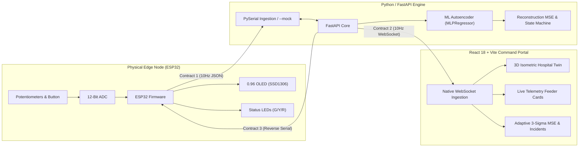

# GRYDAI: SYSTEM REQUIREMENTS SPECIFICATION (SRS)

**Project Name:** GrydAI - AI-Powered Smart Grid Anomaly Monitor & Physical Node  
**Target Environment:** Critical Infrastructure / Live Demonstration  
**Document Status:** Approved & Baseline Synced  

---

## 1. Executive Summary & Objective

GrydAI is an edge-AI command portal for electrical utility operators and critical facility engineers that shifts power grid monitoring from reactive threshold diagnostics to predictive pre-emption.

* **Target End-Users:**
  1. *Regional Utility Distribution System Operators (DSOs):* Monitoring secondary distribution feeders and neighborhood transformers to prevent costly blackouts and equipment destruction.
  2. *Critical Facility Microgrid Managers (Hospitals, Data Centers):* Needing a 10-to-15-minute predictive lead window to execute seamless, synchronized "closed-transition" generator transfers before municipal feeders fail.
* **Deployment Topology (1 Unit per Distribution Transformer):**
  * Sits at the low-voltage secondary side (230V/120V) of neighborhood step-down transformers via standard non-intrusive CT/PT taps.
  * 1 unit protects a cluster of **10 to 50 households**, catching EV fast-charging current surges, solar reverse-voltage spikes, and transformer winding breakdown that slow hourly smart meters cannot detect.
* **Physical Edge Node:** An ESP32 microcontroller simulating **Transformer Node #TR-408** streaming real-time, zero-latency telemetry to the backend.
* **Intelligent Backend:** A Python FastAPI server running an unsupervised machine learning pipeline (Scikit-Learn `MLPRegressor` Autoencoder) calculates live reconstruction Mean Squared Error (MSE) to detect micro-fluctuations before complete outages occur.
* **Bi-Directional Feedback:** Telemetry streams outward over WebSockets to a React 18 + Vite 3D dashboard at 10 Hz, while reverse AI control commands stream back to the ESP32 to switch physical hardware warning LEDs and update an on-board OLED display.



---

## 2. Team Division of Labor & Subsystems

| Subsystem | Components | Deliverables |
| :--- | :--- | :--- |
| **Embedded Firmware** | ESP32 C++ | `/firmware/smart_grid_node/smart_grid_node.ino`, circuit wiring, non-blocking 10 Hz serial loop, OLED display loop, LED driver. |
| **Backend & Machine Learning** | Python 3.10+, FastAPI, Scikit-Learn | `/backend/main.py`, `serial_reader.py`, `ml_pipeline.py`, `mock_generator.py`, `requirements.txt`. |
| **Frontend & 3D Command Portal** | React 18, Vite, Tailwind CSS | `/FrontEnd/src/`, Isometric Hospital 3D digital twin, Adaptive 3-Sigma MSE chart, live incident log, feeder telemetry cards. |

---

## 3. Hardware & Embedded Subsystem Requirements

### 3.1 Electrical Safety Constraints
* **Mandatory Rule:** Live AC mains (110V/220V) are strictly prohibited. The electrical grid is safely simulated using **DC 3.3V / 5.0V** breadboard logic.

### 3.2 Bill of Materials & Pin Configuration (ESP32 38-Pin)
| Component | Pin | Pin Type | Circuit Configuration |
| :--- | :--- | :--- | :--- |
| **Grid Voltage Dial** | **Pin 34** | Analog (ADC1_CH6) | 10 kΩ Potentiometer (Wiper to Pin 34, outer pins to 3V3 & GND). |
| **Line Current Dial** | **Pin 35** | Analog (ADC1_CH7) | 10 kΩ Potentiometer (Wiper to Pin 35, outer pins to 3V3 & GND). |
| **Solar LDR [Optional]** | **Pin 33** | Analog (ADC1_CH5) | Photoresistor voltage divider (defaults safely to 100% if unwired). |
| **Catastrophic Fault Button**| **Pin 32** | Digital Input | Tactile Push Button using **390 Ω pull-down resistor** to GND. |
| **Status LED: Green** | **Pin 25** | Digital Output | 5mm LED + 390 Ω current-limiting resistor to GND. Active-HIGH. |
| **Status LED: Yellow** | **Pin 26** | Digital Output | 5mm LED + 390 Ω current-limiting resistor to GND. Active-HIGH. |
| **Status LED: Red** | **Pin 27** | Digital Output | 5mm LED + 390 Ω current-limiting resistor to GND. Active-HIGH. |
| **I2C OLED Display (SSD1306)**| **SDA: 21, SCL: 22**| I2C Bus | 0.96" 128x64 Monochrome OLED (VCC to 3V3, GND to GND). |

### 3.3 Firmware Timing & Concurrency Rules
1. **Strict Non-Blocking Loop:** Use `millis()` for internal timers. `delay()` must **never** be used.
2. **Telemetry Transmit Rate:** 10 Hz (every 100 ms $\pm 5\text{ms}$) via USB Serial at **115200 baud**.
3. **OLED Display Refresh:** Decoupled to **2 Hz – 3 Hz** (every 350 ms) or triggered on immediate state change to prevent I2C write latency (~25 ms) from stalling the serial stream.
4. **Reverse Command Ingestion:** The serial RX buffer must be read continuously on every `loop()` iteration to parse incoming reverse commands (`S:<status>:<score>\n`) without latency.
5. **Fail-Safe Offline Mode:** If no heartbeat is received from Python within 2000 ms, the OLED indicates `[AI: STANDALONE]` and Yellow LED pulses.

---

## 4. Backend & Machine Learning Subsystem Requirements

### 4.1 Server Environment & Concurrency
* **Framework:** Python 3.10+ with FastAPI and Uvicorn.
* **Network Binding:** `http://localhost:8000` (REST) and `ws://localhost:8000/ws` (WebSocket).
* **CORS:** Enabled for `http://localhost:3000` (Frontend development server).
* **Serial Ingestion:** PySerial reading `readline()` runs in a dedicated background daemon thread so it never blocks the async WebSocket event loop.

### 4.2 CLI Execution Modes
* **Hardware Mode (Default):** `python -m backend.main` (auto-detects connected ESP32 USB COM port or accepts `--port COMx`).
* **Mock / Simulation Mode:** `python -m backend.main --mock` runs fully decoupled without physical hardware, generating synthetic 10 Hz telemetry for frontend testing.

### 4.3 Machine Learning Pipeline (Scikit-Learn Autoencoder & Decision Engine)
* **Architecture:** Scikit-Learn `MLPRegressor` configured as an Autoencoder (`hidden_layer_sizes=(8, 3, 8)`, activation='relu', solver='adam') pre-trained on realistic grid distribution ($V \in [215\text{V}, 225\text{V}]$, $I \in [11\text{A}, 18\text{A}]$) for instant zero-wait startup.
* **Feature Vector:** 4 normalized features: $[V_{\text{sim}}, I_{\text{sim}}, \Delta V, \Delta I]$. Decoupled from solar to eliminate false alerts.
* **Adaptive Thresholding:** Standardized Z-score of reconstruction MSE:
  $$Z = \frac{\text{MSE} - \mu_{\text{MSE}}}{\sigma_{\text{MSE}}}$$
* **Hysteresis & Anti-Flicker Consensus Filter:** Rolling 3-sample buffer with 2-sample majority consensus eliminates sensor noise chatter near state boundaries.
* **Emergency Override:** Hardware push button trips Status 2 (Critical / Red) in $< 10\text{ms}$.

---

## 5. Frontend & Visualization Subsystem Requirements

### 5.1 Architecture & Performance
* **Framework:** React 18, Vite 5, Tailwind CSS.
* **Port:** `http://localhost:3000`.
* **Rendering Optimization:** Real-time 10 Hz telemetry arrives every 100 ms. Component state updates are localized to telemetry cards, 3D canvas aura, and rolling charts to guarantee 60 FPS UI performance.

### 5.2 Core Components & Views
1. **Launch & Gateway Flow:** Cyberpunk-themed pre-launch screen transitioning into an interactive loading sequence with animated gateway nodes.
2. **3D Isometric Hospital Digital Twin (`IsometricHospitalGrid.jsx`):**
   * High-detail 3D hospital facility model with responsive zoom controls (0.28x default context).
   * Live color-coded status aura reflecting transformer health.
3. **Analytics View (`AnalyticsView.jsx`):**
   * **Adaptive 3-Sigma MSE Reconstruction Chart:** Visualizes real-time reconstruction error against a dynamic $+3\sigma$ confidence envelope instead of a static threshold.
   * **Recorded Incident Log:** Classifies actual observed micro-fluctuations into Voltage Sags, Current Surges, Harmonics, and Micro-Arcing (zero synthetic mock data).
4. **Feeder Telemetry Cards:**
   * Voltage Feeder Telemetry: Feeder Voltage ($V$) and Electrical AC Line Frequency ($50.0\text{ Hz}$).
   * Current Feeder Telemetry: Feeder Current ($A$) and Electrical AC Line Frequency ($50.0\text{ Hz}$).
   * Dynamic 13-bar harmonic waveform equalizer.
   * Total Energy consumption card and Grid Stability Index.

---

## 6. Data Communication Contracts

### Contract 1: Hardware to Backend (Serial JSON @ 10 Hz)
```json
{
  "timestamp": 1726178000,
  "v_raw": 2048,
  "i_raw": 2048,
  "fault_btn": 0,
  "solar_ldr": 4095
}
```

### Contract 2: Backend to Frontend (WebSocket JSON @ 10 Hz)
```json
{
  "timestamp": 1726178000,
  "raw": {
    "v_raw": 2048,
    "i_raw": 2048,
    "fault_btn": 0
  },
  "metrics": {
    "voltage_sim": 220.1,
    "current_sim": 15.0,
    "solar_efficiency": 100.0,
    "frequency_sim": 50.0,
    "frequency": 50.0,
    "current_kw": 3.3,
    "energy_percent": 41,
    "stability": 98.4,
    "waveform": [65, 70, 78, 82, 85, 82, 78, 70, 65, 58, 52, 45, 38]
  },
  "ai_prediction": {
    "anomaly_score": -0.85,
    "grid_status": 0,
    "message": "System Stable - Normal Feeder Telemetry",
    "reconstruction_mse": 0.0024,
    "z_score": 0.45,
    "adaptive_threshold": 0.89
  }
}
```

### Contract 3: Backend to Hardware (Reverse Serial Command @ State Change / 2 Hz)
```text
S:<grid_status>:<anomaly_score>\n
```
* **Format:** `S:0:-0.85\n`
* `grid_status`: `0` (Normal/Green), `1` (Warning/Yellow), `2` (Critical/Red)
* `anomaly_score`: Normalized score between -1.00 and 1.00 for local OLED display.
