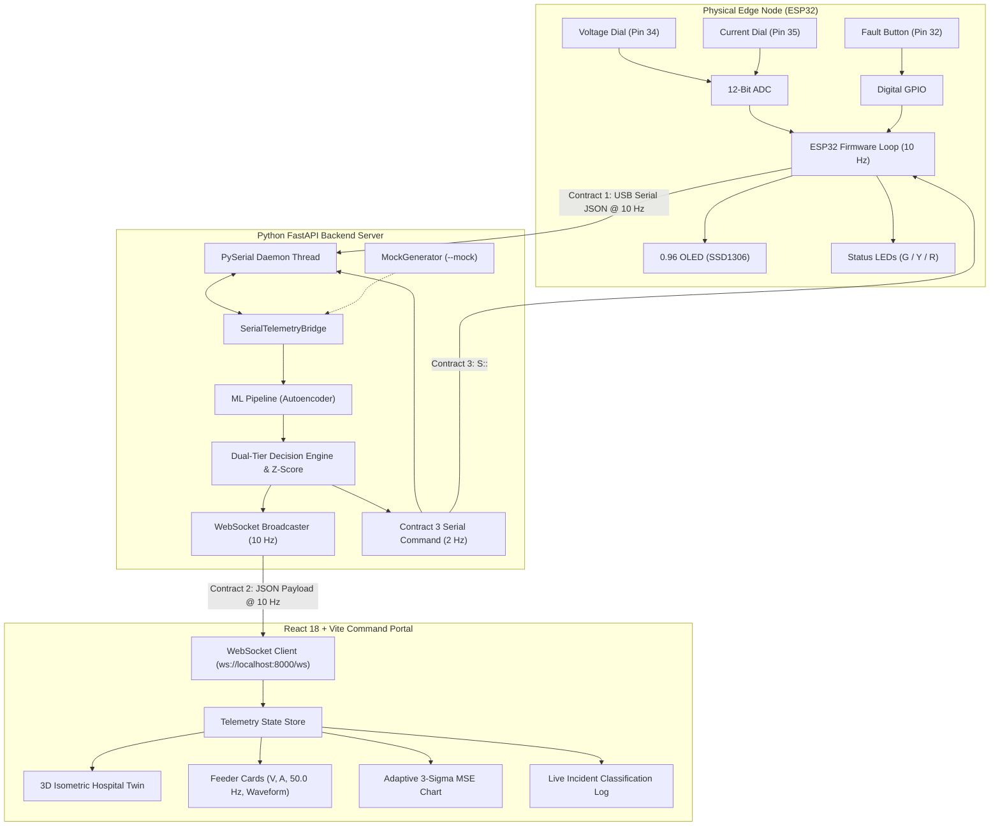

# GrydAI — Edge-AI Smart Grid Anomaly Monitor & Physical Node

<div align="center">

[](https://www.python.org/)
[](https://fastapi.tiangolo.com/)
[](https://react.dev/)
[](https://vitejs.dev/)
[-E7352C.svg?style=flat-square&logo=espressif)](https://www.espressif.com/)
[](https://scikit-learn.org/)
[](https://tailwindcss.com/)
[](LICENSE)

**The AI Collision-Avoidance Radar for the Electrical Grid:**  
*Predicting secondary distribution transformer failure and dirty-power degradation 10 to 15 minutes before catastrophic failure using unsupervised edge machine learning.*

</div>

---

## ⚡ Executive Overview: The "Airbag vs. Radar" Problem

Across modern distribution grids, neighborhood step-down transformers (stepping 11kV/33kV down to 230V/120V) face unprecedented stress from **simultaneous EV fast-charging surges** and **rooftop solar backfeeding spikes**. Traditional utilities operate almost completely blind at this level:
- **Residential Smart Meters** only transmit billing summaries once every hour—useless for sub-second electrical fault prevention.
- **Substation SCADA** sits miles upstream and cannot isolate localized feeder coil thermal runaway.
- **Emergency Diesel Generators & UPS Systems** are like **airbags**—under NFPA 110, emergency generators take **10 to 15 seconds** to crank and accept full load, while inverters cannot mitigate prolonged 190V brownouts and harmonic distortion that trigger catastrophic MRI helium quenches ($80,000+ per event) or robotic surgical crashes.

**GrydAI is the collision-avoidance radar.** Deployed as a dedicated edge monitor directly at the transformer's low-voltage secondary side, GrydAI ingests 10 Hz high-frequency electrical telemetry. Using an unsupervised Autoencoder, it identifies micro-arcing and insulation breakdown **10–15 minutes early**, enabling automated, synchronized closed-transition generator transfers and DSO load shedding before physical equipment explodes.

---

## 🌟 Key Features

- **Micro-Hardware Edge Node (ESP32):** Reads 12-bit analog voltage/current signals at 10 Hz, drives an on-board SSD1306 OLED display, and responds to reverse serial AI commands via physical Green/Yellow/Red indicator LEDs.
- **Unsupervised Autoencoder (`MLPRegressor`):** Learns healthy resting electrical baseline waveforms ($\mathbf{x} \rightarrow \mathbf{\hat{x}}$). Any anomalous sag, harmonic surge, or micro-fluctuation causes Reconstruction Mean Squared Error (MSE) to spike immediately.
- **Adaptive 3-Sigma Reconstruction Bounds:** Replaces rigid, static trip thresholds with dynamic $+3\sigma$ confidence bands that automatically adapt to evolving grid loads.
- **Interactive 3D Hospital Digital Twin:** Real-time 3D isometric facility visualization with dynamic color-coded vulnerability auras (Normal Green, Warning Amber, Critical Red) and responsive spatial framing controls.
- **Live Feeder Telemetry Cards:** Displays real-time feeder voltage, line current, and the **50.0 Hz AC line frequency** alongside a dynamic 13-bar harmonic waveform equalizer.
- **Sub-10ms Emergency Override:** Immediate hardware push-button interrupt bypassing digital filters for instantaneous trip protection upon catastrophic line breaks.
- **Anti-Flicker Consensus Filter:** Multi-tier rolling consensus buffer preventing ADC thermal jitter at state transition boundaries.
- **Live Incident Classification:** Automatically records real-time transient sags, surges, and micro-arcing directly from live telemetry with zero synthetic mock dependencies.

---

## 📐 System Architecture



---

## 🔌 Hardware Inventory & ESP32 Pinout

The physical prototype simulates the electrical grid safely using 3.3V/5V DC components (no live AC mains):

| Component | ESP32 Pin | Type | Function / Circuit Notes |
| :--- | :--- | :--- | :--- |
| **Grid Voltage Dial** | **Pin 34** | Analog (ADC1_CH6) | 10 kΩ Potentiometer (Wiper to Pin 34, outer pins to 3V3 & GND). |
| **Line Current Dial** | **Pin 35** | Analog (ADC1_CH7) | 10 kΩ Potentiometer (Wiper to Pin 35, outer pins to 3V3 & GND). |
| **Solar Irradiance LDR** | **Pin 33** | Analog (ADC1_CH5) | Photoresistor voltage divider (defaults safely to 100% if unwired). |
| **Catastrophic Fault Button** | **Pin 32** | Digital Input | Tactile Push Button with **390 Ω pull-down resistor** to GND. |
| **Status LED: Green (Normal)** | **Pin 25** | Digital Output | 5mm LED + 390 Ω current-limiting resistor to GND. Active-HIGH. |
| **Status LED: Yellow (Warning)** | **Pin 26** | Digital Output | 5mm LED + 390 Ω current-limiting resistor to GND. Active-HIGH. |
| **Status LED: Red (Critical)** | **Pin 27** | Digital Output | 5mm LED + 390 Ω current-limiting resistor to GND. Active-HIGH. |
| **I2C OLED Display (SSD1306)** | **SDA: 21, SCL: 22** | I2C Bus | 0.96" 128x64 OLED (VCC to 3V3, GND to GND). Refreshes at 2–3 Hz. |

---

## 📜 Data Communication Contracts

### Contract 1: Hardware to Backend (USB Serial JSON @ 10 Hz)
```json
{
  "timestamp": 1726178000,
  "v_raw": 2048,
  "i_raw": 2048,
  "fault_btn": 0,
  "solar_ldr": 4095
}
```

### Contract 2: Backend to Frontend (WebSocket JSON @ 10 Hz)
```json
{
  "timestamp": 1726178000,
  "raw": {
    "v_raw": 2048,
    "i_raw": 2048,
    "fault_btn": 0
  },
  "metrics": {
    "voltage_sim": 220.1,
    "current_sim": 15.0,
    "solar_efficiency": 100.0,
    "frequency_sim": 50.0,
    "frequency": 50.0,
    "current_kw": 3.3,
    "energy_percent": 41,
    "stability": 98.4,
    "waveform": [65, 70, 78, 82, 85, 82, 78, 70, 65, 58, 52, 45, 38]
  },
  "ai_prediction": {
    "anomaly_score": -0.85,
    "grid_status": 0,
    "message": "System Stable - Normal Feeder Telemetry",
    "reconstruction_mse": 0.0024,
    "z_score": 0.45,
    "adaptive_threshold": 0.89
  }
}
```

### Contract 3: Backend to Hardware (Reverse Serial Control @ 2 Hz / State Change)
```text
S:<grid_status>:<anomaly_score>\n
```
* Example: `S:0:-0.85\n`
* `grid_status`: `0` (Normal/Green LED), `1` (Warning/Yellow LED), `2` (Critical/Red LED)
* `anomaly_score`: Normalized score between -1.00 and 1.00 for local OLED rendering.

---

## 🚀 Quickstart & Installation

### Prerequisites
- **Python:** 3.10 or higher
- **Node.js:** 18.0 or higher (with npm)
- **Arduino IDE / PlatformIO:** (For flashing ESP32 firmware)

---

### 1. Embedded Firmware (ESP32)
1. Open [`firmware/smart_grid_node/smart_grid_node.ino`](firmware/smart_grid_node/smart_grid_node.ino) in Arduino IDE.
2. Install required libraries via Library Manager:
   - `Adafruit SSD1306`
   - `Adafruit GFX Library`
   - `ArduinoJson` (v6 or v7)
3. Select board: **ESP32 Dev Module**.
4. Connect ESP32 via USB and click **Upload**.

---

### 2. Backend Server (Python FastAPI)
1. Navigate to the project root and install Python dependencies:
   ```bash
   pip install -r requirements.txt
   ```
2. Start the backend in **Hardware Mode** (auto-detects USB serial):
   ```bash
   python -m backend.main
   ```
   *Or specify a custom COM port and baud rate:*
   ```bash
   python -m backend.main --port COM3 --baud 115200
   ```
3. *(Alternative)* Run in **Mock Simulation Mode** (no hardware needed):
   ```bash
   python -m backend.main --mock
   ```
4. Confirm server health at `http://localhost:8000/`.

---

### 3. Frontend Command Portal (React 18 + Vite)
1. Navigate to the frontend directory and install dependencies:
   ```bash
   cd FrontEnd
   npm install
   ```
2. Start the development server:
   ```bash
   npm run dev
   ```
3. Open `http://localhost:3000/` in your browser.
4. Click **Launch System** to open the interactive command portal.

---

## 🎬 3-Minute Live Demo Pitch Script

Follow this choreography for live demonstrations to maximize technical impact:

1. **[0:00 - 0:45] The Blindspot & Concept:**
   - *"Existing solutions are airbags—they only trigger after the transformer explodes. Hourly smart meters and upstream substations are blind to localized neighborhood transformer stress. GrydAI is the radar."*
2. **[0:45 - 1:15] Baseline Telemetry:**
   - Point to the live dashboard streaming from **Transformer Node #TR-408** at 10 Hz.
   - Note the healthy nominal parameters: **220V**, **15A**, **50.0 Hz AC line frequency**, Stability index at **98%**, and Green hardware LED lit.
3. **[1:15 - 2:00] Simulated EV Overload (Potentiometer Turn):**
   - Turn the Current dial to simulate neighborhood EV charging surge ($>18.5\text{A}$).
   - Within **200 ms**, show the **Reconstruction MSE curve spiking** through the adaptive confidence envelope on the Analytics tab.
   - The 3D Hospital facility pulses amber warning (Status 1), and the hardware Yellow LED clicks ON.
4. **[2:00 - 2:30] Catastrophic Line Fault (Button Tap):**
   - Tap the physical push button simulating an instantaneous line drop.
   - In **$< 10\text{ms}$**, the system triggers a Red lockdown (Status 2), firing the hardware Red LED and activating the emergency transfer alert.
5. **[2:30 - 3:00] Business & Environmental Impact:**
   - Highlight the avoided metrics: **$48,500** transformer replacement avoided, **42 minutes** of surgical downtime prevented, and **2.4 metric tons** of peaker plant $CO_2$ emissions avoided.

---

## ❓ Frequently Asked Questions (FAQ)

<details>
<summary><b>Why do the telemetry cards show 50.0 Hz when data updates at 10 Hz?</b></summary>
<br>
They measure two distinct phenomena that both share the unit Hertz (Hz):
1. <b>50.0 Hz (Grid AC Line Frequency):</b> The physical alternating current (AC) frequency of the electrical power grid (standard in India, UK, Europe, etc.).
2. <b>10 Hz (Telemetry Data Rate):</b> How frequently the ESP32 serial bridge and WebSocket emit telemetry JSON packets (10 updates per second / every 100 ms).
</details>

<details>
<summary><b>Why use an unsupervised Autoencoder instead of strict threshold rules?</b></summary>
<br>
Fixed thresholds (e.g., <code>voltage < 198V</code>) only catch faults when failure is already imminent. Insulation breakdown, winding thermal stress, and loose connections manifest as high-frequency micro-fluctuations and harmonic distortion within normal voltage bounds. The Autoencoder detects these subtle waveform anomalies 10–15 minutes before thresholds are breached.
</details>

<details>
<summary><b>Why is the solar irradiance decoupled from the core transformer ML pipeline?</b></summary>
<br>
Solar irradiance varies naturally due to cloud cover and nighttime cycles. If solar were part of the transformer health autoencoder vector, normal sunset would trigger false transformer anomaly alarms. Solar is therefore tracked as auxiliary grid context while the core autoencoder focuses strictly on $[V, I, \Delta V, \Delta I]$.
</details>

---

## 📁 Repository Structure

```text
GrydAI/
├── README.md                        # Master repository documentation
├── requirements.txt                 # Core Python dependencies
├── monitor_pot.py                   # Live CLI debugging tool for hardware ADC
├── firmware/                        # Embedded C++ Firmware
│   └── smart_grid_node/
│       └── smart_grid_node.ino      # ESP32 10 Hz non-blocking loop & OLED driver
├── backend/                         # Python Backend Engine
│   ├── main.py                      # FastAPI server, REST routes & WebSocket broadcaster
│   ├── serial_reader.py             # Background thread for USB serial telemetry
│   ├── ml_pipeline.py               # Autoencoder, adaptive Z-score & consensus filter
│   ├── mock_generator.py            # 10 Hz synthetic telemetry generator (--mock)
│   ├── verify_fault_detection.py    # Automated test suite for fault latency
│   └── requirements.txt             # Backend-specific requirements
├── FrontEnd/                        # React 18 + Vite Web Application
│   ├── package.json                 # Frontend dependencies & scripts
│   ├── vite.config.js               # Dev server configuration (port 3000)
│   └── src/
│       ├── App.jsx                  # Main application state & screen router
│       ├── components/
│       │   ├── LaunchScreen.jsx     # High-tech initial launch screen
│       │   ├── LoadingScreen.jsx    # Gateway sequence & branding loader
│       │   ├── LandingPage.jsx      # Primary command portal with WebSocket hook
│       │   ├── Navbar.jsx           # Global status bar & navigation
│       │   └── dashboard/
│       │       ├── IsometricHospitalGrid.jsx # 3D Digital Twin with responsive zoom
│       │       ├── AnalyticsView.jsx         # Adaptive 3-Sigma MSE & incident log
│       │       ├── VoltageTelemetryCard.jsx  # Feeder voltage & 50.0 Hz line frequency
│       │       ├── CurrentTelemetryCard.jsx  # Feeder current & 50.0 Hz line frequency
│       │       ├── StabilityIndexCard.jsx    # ML-driven grid stability index
│       │       └── TotalEnergyCard.jsx       # Real-time power load & consumption
└── Guide/                           # Detailed technical guides & specifications
    ├── architecture.md              # Detailed architecture blueprint
    ├── context.md                   # Problem domain & value proposition
    ├── requirements.md              # System requirements specification (SRS)
    └── plan.md                      # Development milestones & execution roadmap
```

---

## 📄 License

This project is licensed under the MIT License — see the [LICENSE](LICENSE) file for details.
